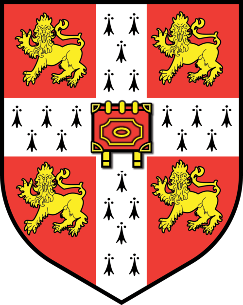

# Multilingual Edge LLMs: Survey of Methods and Challenges

This repository contains all the experiments for the Multilingual Edge LLM project.
The first portion of this work as a survey, which looks at existing literature in multilingual and efficient NLP to condense a potential recipe for multilingual edge LLMs.

## Installation

This project uses [uv](https://docs.astral.sh/uv/) for dependency management.

```bash
git clone git@github.com:ljvmiranda921/multilingual-edge-nlp.git
cd multilingual-edge-nlp
uv sync
```

## Data Sources

In this section, we list down the data sources to build some of the supporting figures.
You should be able to replicate the figures by running `python -m analysis.<script_name>`.

- [Share of population in range of mobile network](https://ourworldindata.org/grapher/population-covered-by-mobile-network-by-network-capability): [International Telecommunication Union](https://unstats.un.org/sdgs/dataportal), processed by [Our World in Data](https://ourworldindata.org/)
- [Living languages per country](https://ourworldindata.org/grapher/living-languages): [SIL International, Ethnologue (28th edition)](https://www.ethnologue.com/), processed by [Our World in Data](https://ourworldindata.org/)
- [ICT adoption per 100 people](https://ourworldindata.org/grapher/ict-adoption-per-100-people): [International Telecommunication Union](https://www.itu.int/) via [World Bank World Development Indicators](https://databank.worldbank.org/source/world-development-indicators), processed by [Our World in Data](https://ourworldindata.org/)
- [World Bank income groups](https://ourworldindata.org/grapher/world-bank-income-groups): [World Bank Country and Lending Groups](https://datahelpdesk.worldbank.org/knowledgebase/articles/906519-world-bank-country-and-lending-groups), processed by [Our World in Data](https://ourworldindata.org/)

## Acknowledgements

LJVM and AK acknowledge the support of the UKRI Frontier Grant EP/Y031350/1 ([EQUATE](https://gtr.ukri.org/projects?ref=EP%2FY031350%2F1)).